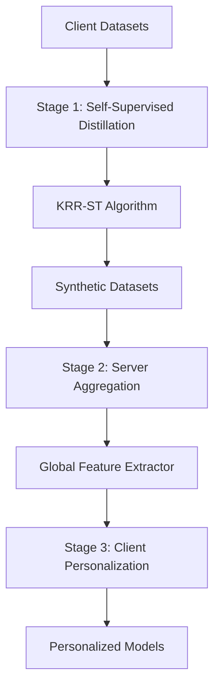

# POSFed: Tackling Non-IID Challenges in One-Shot Federated Learning via Personalization

This repository contains the official PyTorch implementation of **POSFed** (Personalized One-Shot Federated Learning), a novel framework that addresses non-IID data challenges in federated learning through a three-stage approach combining self-supervised dataset distillation and personalized transfer learning.

## 📋 Table of Contents

- [Overview](#overview)
- [Key Features](#key-features)
- [Installation](#installation)
- [Quick Start](#quick-start)
- [Detailed Usage](#detailed-usage)
- [Configuration](#configuration)
- [Experimental Results](#experimental-results)
- [Architecture](#architecture)
- [Contributing](#contributing)
- [Citation](#citation)
- [License](#license)

## 🎯 Overview

POSFed addresses three fundamental distribution shifts in federated learning:

1. **Label Shift**: Varying class proportions across clients
2. **Feature Shift**: Different spatial distributions of same-class samples
3. **Concept Shift**: Varying decision boundaries and label noise

### Three-Stage Framework

1. **Stage 1: Self-Supervised Dataset Distillation**
   - Each client generates label-agnostic synthetic datasets using KRR-ST (Kernel Ridge Regression on Self-Supervised Targets)
   - Eliminates label distribution conflicts while preserving essential knowledge

2. **Stage 2: Global Feature Extractor Learning**
   - Server aggregates synthetic datasets and trains a global feature extractor
   - Captures generalizable representations across heterogeneous client data

3. **Stage 3: Client-Specific Personalization**
   - Clients freeze the global feature extractor and train personalized classification heads
   - Enables effective local adaptation while maintaining global knowledge

## ✨ Key Features

- **One-Shot Communication**: Complete federated learning in a single communication round
- **Superior Performance**: Matches or exceeds multi-round personalized FL methods
- **Three Distribution Shifts**: Systematically addresses label, feature, and concept shifts
- **Communication Efficient**: POSFed-K variant reduces communication overhead by 80-90%
- **Comprehensive Baselines**: Includes implementations of FedAvg, Per-FedAvg, DOSFL, and more
- **Multiple Datasets**: Supports MNIST, Fashion-MNIST, CIFAR-10, and SVHN
- **Flexible Configuration**: Easy-to-use configuration system for different experimental settings

## 🛠 Installation

### Prerequisites

- Python 3.8+
- PyTorch 1.9+
- CUDA (optional, for GPU acceleration)

### Dependencies

```bash
# Clone the repository
git clone https://github.com/yourusername/POSFed.git
cd POSFed

# Install required packages
pip install torch torchvision numpy scikit-learn matplotlib tqdm

# Or use conda
conda install pytorch torchvision numpy scikit-learn matplotlib tqdm -c pytorch
```

### Optional Dependencies

```bash
# For advanced plotting and analysis
pip install seaborn pandas jupyter

# For faster computations
pip install numba
```

## 🚀 Quick Start

### Basic POSFed Experiment

```bash
# Run POSFed on CIFAR-10 with label shift
python experiment_runner.py --dataset cifar10 --shift_type label_shift --beta 0.1

# Run POSFed-K variant
python experiment_runner.py --dataset cifar10 --shift_type label_shift --beta 0.1 --use_posfed_k --k 10

# Save results to file
python experiment_runner.py --dataset cifar10 --shift_type label_shift --beta 0.1 --save_results
```

### Comprehensive Comparison

```bash
# Compare POSFed with all baseline methods across different settings
python comparison_script.py --dataset cifar10

# Quick test with reduced settings
python comparison_script.py --dataset cifar10 --quick_test

# Create configuration templates
python comparison_script.py --create_configs
```

### Using Configuration Files

```bash
# Run with custom configuration
python experiment_runner.py --config configs/label_shift_config.json

# Compare using configuration
python comparison_script.py --config configs/feature_shift_config.json
```

## 📖 Detailed Usage

### Running Individual Experiments

#### 1. Label Shift Experiments

```bash
# Severe label imbalance (β=0.1)
python experiment_runner.py --dataset cifar10 --shift_type label_shift --beta 0.1

# Moderate label imbalance (β=0.3)
python experiment_runner.py --dataset cifar10 --shift_type label_shift --beta 0.3

# Mild label imbalance (β=0.5)
python experiment_runner.py --dataset cifar10 --shift_type label_shift --beta 0.5
```

#### 2. Feature Shift Experiments

```bash
# Mild rotation (15°)
python experiment_runner.py --dataset cifar10 --shift_type feature_shift --max_rotation 15

# Moderate rotation (30°)
python experiment_runner.py --dataset cifar10 --shift_type feature_shift --max_rotation 30

# Severe rotation (45°)
python experiment_runner.py --dataset cifar10 --shift_type feature_shift --max_rotation 45
```

#### 3. Concept Shift Experiments

```bash
# Low noise (1%)
python experiment_runner.py --dataset cifar10 --shift_type concept_shift --max_noise_rate 0.01

# Medium noise (3%)
python experiment_runner.py --dataset cifar10 --shift_type concept_shift --max_noise_rate 0.03

# High noise (5%)
python experiment_runner.py --dataset cifar10 --shift_type concept_shift --max_noise_rate 0.05
```

### POSFed-K Communication Efficiency

```bash
# Different numbers of participating clients
python experiment_runner.py --dataset cifar10 --use_posfed_k --k 5    # 5% participation
python experiment_runner.py --dataset cifar10 --use_posfed_k --k 10   # 10% participation
python experiment_runner.py --dataset cifar10 --use_posfed_k --k 20   # 20% participation
python experiment_runner.py --dataset cifar10 --use_posfed_k --k 50   # 50% participation
```

### Programmatic Usage

```python
from posfed_framework import POSFedFramework
from data_utils import DataUtils, get_dataset_info
from experiment_runner import create_default_config

# Load dataset
train_dataset, test_dataset = DataUtils.load_dataset('cifar10')

# Create non-IID data
client_datasets = DataUtils.create_non_iid_label_shift(train_dataset, num_clients=100, beta=0.1)
client_test_datasets = DataUtils.create_non_iid_label_shift(test_dataset, num_clients=100, beta=0.1)

# Configure POSFed
config = create_default_config()
config.update(get_dataset_info('cifar10'))

# Run POSFed
posfed = POSFedFramework(config)
results = posfed.run_posfed(client_datasets, client_test_datasets)

print(f"Average Accuracy: {results['average_accuracy']:.2f}%")
```

## ⚙️ Configuration

### Configuration Parameters

| Parameter | Description | Default | Options |
|-----------|-------------|---------|---------|
| `dataset` | Dataset name | `cifar10` | `mnist`, `fmnist`, `cifar10`, `svhn` |
| `num_clients` | Number of federated clients | `100` | Any positive integer |
| `shift_type` | Type of non-IID shift | `label_shift` | `label_shift`, `feature_shift`, `concept_shift` |
| `beta` | Dirichlet parameter for label shift | `0.1` | 0.1-1.0 (lower = more non-IID) |
| `max_rotation` | Maximum rotation angle for feature shift | `30.0` | 0-180 degrees |
| `max_noise_rate` | Maximum noise rate for concept shift | `0.05` | 0.0-1.0 |
| `synthetic_size` | Synthetic samples per client | `100` | Any positive integer |
| `use_posfed_k` | Enable POSFed-K variant | `false` | `true`, `false` |
| `k` | Number of participating clients in POSFed-K | `10` | 1 to `num_clients` |

### Training Parameters

| Parameter | Description | Default |
|-----------|-------------|---------|
| `global_epochs` | Global feature extractor training epochs | `100` |
| `local_epochs` | Local personalization epochs | `100` |
| `batch_size` | Training batch size | `256` |
| `global_lr` | Global learning rate | `0.001` |
| `local_lr` | Local learning rate | `0.01` |

### KRR-ST Parameters

| Parameter | Description | Default |
|-----------|-------------|---------|
| `lambda_reg` | Regularization parameter for KRR | `0.01` |
| `pool_size` | Model pool size | `5` |
| `max_steps` | Maximum steps per model in pool | `100` |
| `feature_dim` | Feature extractor output dimension | `256` |

### Example Configuration File

```json
{
  "dataset": "cifar10",
  "num_clients": 100,
  "shift_type": "label_shift",
  "beta": 0.1,
  "synthetic_size": 100,
  "feature_dim": 256,
  "global_epochs": 100,
  "local_epochs": 100,
  "batch_size": 256,
  "global_lr": 0.001,
  "local_lr": 0.01,
  "lambda_reg": 0.01,
  "pool_size": 5,
  "max_steps": 100,
  "use_posfed_k": false,
  "k": 10,
  "seed": 42
}
```

## 📊 Experimental Results

### Performance on CIFAR-10 (Label Shift, β=0.1)

| Method | Average Accuracy | Std Deviation | Communication Rounds |
|--------|------------------|---------------|---------------------|
| **POSFed (Ours)** | **63.42%** | **2.3%** | **1** |
| POSFed-K (K=10) | 62.18% | 2.7% | 1 |
| Per-FedAvg | 54.16% | 4.2% | 100 |
| FedAvg | 46.85% | 5.1% | 100 |
| GlobalDM | 57.97% | 3.8% | 1 |
| DOSFL | 43.92% | 6.2% | 1 |

### Communication Efficiency

- **POSFed**: 1 communication round, 100% client participation
- **POSFed-K**: 1 communication round, 10-20% client participation with 90-95% performance retention

### Key Findings

1. **Superior Performance**: POSFed outperforms all one-shot methods and matches multi-round personalized approaches
2. **Communication Efficiency**: Achieves excellent results with only one communication round
3. **Robust to Non-IID**: Maintains performance across different types and severities of distribution shifts
4. **Scalable**: POSFed-K enables deployment in resource-constrained environments

## 🏗 Architecture

### Project Structure

```
POSFed/
├── posfed_framework.py          # Core POSFed implementation
├── data_utils.py               # Data loading and non-IID partitioning
├── experiment_runner.py        # Main experiment runner
├── baseline_methods.py         # Baseline method implementations
├── comparison_script.py        # Comprehensive comparison script
├── configs/                    # Configuration templates
│   ├── label_shift_config.json
│   ├── feature_shift_config.json
│   ├── concept_shift_config.json
│   └── posfed_k_config.json
├── results/                    # Experimental results
├── plots/                     # Generated plots
├── data/                      # Dataset storage
└── README.md
```

### Core Components

#### POSFedFramework (`posfed_framework.py`)
- Main framework implementing the three-stage algorithm
- Coordinates between self-supervised distillation and personalization
- Handles model aggregation and distribution

#### KRRSTDistiller (`posfed_framework.py`)
- Implements Kernel Ridge Regression on Self-Supervised Targets
- Performs bilevel optimization for synthetic data generation
- Uses Barlow Twins for self-supervised learning

#### DataUtils (`data_utils.py`)
- Handles dataset loading and preprocessing
- Implements non-IID data partitioning strategies
- Supports multiple types of distribution shifts

#### BaselineMethods (`baseline_methods.py`)
- Implementations of comparison methods
- Includes FedAvg, Per-FedAvg, DOSFL, LocalDM, GlobalDM
- Provides fair comparison framework

### Algorithm Flow



## 🤝 Contributing

We welcome contributions! Please see our contributing guidelines:

1. Fork the repository
2. Create a feature branch (`git checkout -b feature/amazing-feature`)
3. Commit your changes (`git commit -m 'Add amazing feature'`)
4. Push to the branch (`git push origin feature/amazing-feature`)
5. Open a Pull Request

### Areas for Contribution

- Additional datasets and benchmarks
- New baseline methods
- Performance optimizations
- Documentation improvements
- Bug fixes and testing

## 📚 Citation

If you use this code in your research, please cite our paper:

```bibtex
@article{posfed2024,
  title={POSFed: Tackling Non-IID Challenges in One-Shot Federated Learning via Personalization},
  author={[Authors]},
  journal={[Journal]},
  year={2024}
}
```

## 📄 License

This project is licensed under the MIT License - see the [LICENSE](LICENSE) file for details.

## 🙏 Acknowledgments

- Original KRR-ST implementation
- PyTorch and torchvision teams
- Federated learning research community
- Dataset providers (MNIST, Fashion-MNIST, CIFAR-10, SVHN)

## 📞 Contact

For questions, issues, or collaboration opportunities:

- GitHub Issues: [Create an issue](https://github.com/yourusername/POSFed/issues)
- Email: [your.email@university.edu]

---

**Note**: This implementation is based on the research paper "POSFed: Tackling Non-IID Challenges in One-Shot Federated Learning via Personalization". Please refer to the paper for detailed algorithmic descriptions and theoretical analysis.
